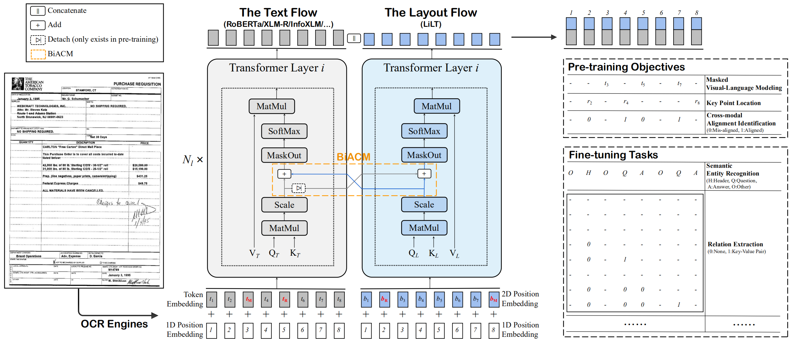
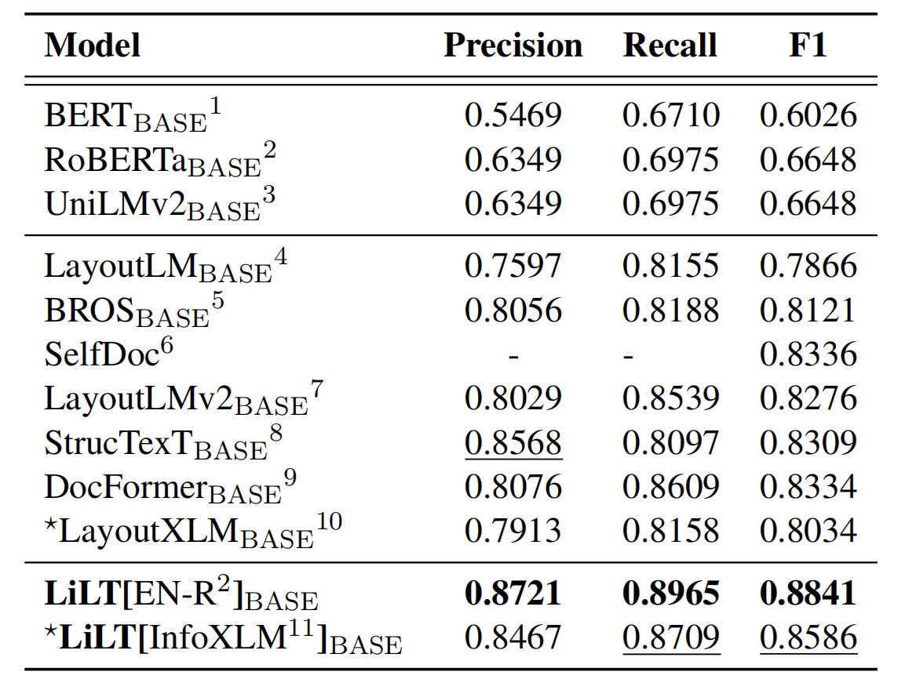
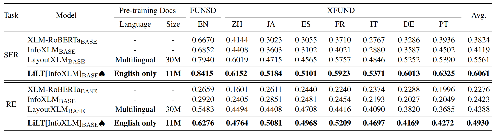
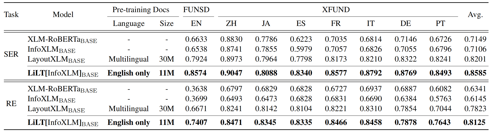

# What's New

[2022/10] LiLT has been added to 🤗[huggingface/transformers](https://github.com/huggingface/transformers) in [HERE](https://huggingface.co/docs/transformers/main/model_doc/lilt).

[2022/03] Initial model and code release.

# LiLT (ACL 2022)

This is the official PyTorch implementation of the ACL 2022 paper: "LiLT: A Simple yet Effective Language-Independent Layout Transformer for Structured Document Understanding". [[official](https://aclanthology.org/2022.acl-long.534/)] [[arXiv](https://arxiv.org/abs/2202.13669)] 



LiLT is pre-trained on the visually-rich documents of a single language (English) and can be directly fine-tuned on other languages with the corresponding off-the-shelf monolingual/multilingual pre-trained textual models. We hope the public availability of this work can help document intelligence researches.

## Installation

For CUDA 11.X: 

~~~bash
conda create -n liltfinetune python=3.7
conda activate liltfinetune
conda install pytorch==1.7.1 torchvision==0.8.2 cudatoolkit=11.0 -c pytorch
python -m pip install detectron2==0.5 -f https://dl.fbaipublicfiles.com/detectron2/wheels/cu110/torch1.7/index.html
git clone https://github.com/jpWang/LiLT
cd LiLT
pip install -r requirements.txt
pip install -e .
~~~

Or check [Detectron2](https://github.com/facebookresearch/detectron2/releases)/[PyTorch](https://pytorch.org/get-started/previous-versions/) versions and modify the command lines accordingly.

## Datasets

In this repository, we provide the fine-tuning codes for [FUNSD](https://guillaumejaume.github.io/FUNSD/) and [XFUND](https://github.com/doc-analysis/XFUND). 

You can download our **pre-processed data (~1.2GB)** from [**HERE**](https://1drv.ms/u/s!Ahd-h7H5akVZeZQvKieg8g5THV8?e=mBRnxw), and put the unzipped `xfund&funsd/` under `LiLT/`. 

## Available Checkpoints

| Model                         | Language  | Size  | Download     | 
| ----------------------------- | --------- | ----- | ------------ |
| `lilt-roberta-en-base`        | EN        | 293MB | [OneDrive](https://1drv.ms/u/s!Ahd-h7H5akVZfhPVHQQ1tOypA48?e=nraHn3)    | 
| `lilt-infoxlm-base`           | MUL       | 846MB | [OneDrive](https://1drv.ms/u/s!Ahd-h7H5akVZfeIhAQ8KHELRvcc?e=WS1P82)    |
| `lilt-only-base`              | None      | 21MB  | [OneDrive](https://1drv.ms/u/s!Ahd-h7H5akVZfEIRbCmcWKjhoSM?e=6tMGbe)    | 

## Or Generate Your Own Checkpoint (Optional)

If you want to combine the pre-trained LiLT with **other language's *RoBERTa***, please download  `lilt-only-base` and use `gen_weight_roberta_like.py` to generate your own pre-trained checkpoint.

**For example,** combine `lilt-only-base` with English `roberta-base`:

~~~bash
mkdir roberta-en-base
wget https://huggingface.co/roberta-base/resolve/main/config.json -O roberta-en-base/config.json
wget https://huggingface.co/roberta-base/resolve/main/pytorch_model.bin -O roberta-en-base/pytorch_model.bin
python gen_weight_roberta_like.py \
     --lilt lilt-only-base/pytorch_model.bin \
     --text roberta-en-base/pytorch_model.bin \
     --config roberta-en-base/config.json \
     --out lilt-roberta-en-base
~~~

Or combine `lilt-only-base` with `microsoft/infoxlm-base`:

~~~bash
mkdir infoxlm-base
wget https://huggingface.co/microsoft/infoxlm-base/resolve/main/config.json -O infoxlm-base/config.json
wget https://huggingface.co/microsoft/infoxlm-base/resolve/main/pytorch_model.bin -O infoxlm-base/pytorch_model.bin
python gen_weight_roberta_like.py \
     --lilt lilt-only-base/pytorch_model.bin \
     --text infoxlm-base/pytorch_model.bin \
     --config infoxlm-base/config.json \
     --out lilt-infoxlm-base
~~~


## Fine-tuning


### Semantic Entity Recognition on FUNSD

```
CUDA_VISIBLE_DEVICES=0,1,2,3 python -m torch.distributed.launch --nproc_per_node=4 examples/run_funsd.py \
        --model_name_or_path lilt-roberta-en-base \
        --tokenizer_name roberta-base \
        --output_dir ser_funsd_lilt-roberta-en-base \
        --do_train \
        --do_predict \
        --max_steps 2000 \
        --per_device_train_batch_size 8 \
        --warmup_ratio 0.1 \
        --fp16
```

### Language-specific (For example, ZH) Semantic Entity Recognition on XFUND

```
CUDA_VISIBLE_DEVICES=0,1,2,3 python -m torch.distributed.launch --nproc_per_node=4 examples/run_xfun_ser.py \
        --model_name_or_path lilt-infoxlm-base \
        --tokenizer_name xlm-roberta-base \
        --output_dir ls_ser_xfund_zh_lilt-infoxlm-base \
        --do_train \
        --do_eval \
        --lang zh \
        --max_steps 2000 \
        --per_device_train_batch_size 16 \
        --warmup_ratio 0.1 \
        --fp16
```

### Language-specific (For example, ZH) Relation Extraction on XFUND

```
CUDA_VISIBLE_DEVICES=0,1,2,3 python -m torch.distributed.launch --nproc_per_node=4 examples/run_xfun_re.py \
        --model_name_or_path lilt-infoxlm-base \
        --tokenizer_name xlm-roberta-base \
        --output_dir ls_re_xfund_zh_lilt-infoxlm-base \
        --do_train \
        --do_eval \
        --lang zh \
        --max_steps 5000 \
        --per_device_train_batch_size 8 \
        --learning_rate  6.25e-6 \
        --warmup_ratio 0.1 \
        --fp16
```

### Multi-task Semantic Entity Recognition on XFUND

```
CUDA_VISIBLE_DEVICES=0,1,2,3 python -m torch.distributed.launch --nproc_per_node=4 examples/run_xfun_ser.py \
        --model_name_or_path lilt-infoxlm-base \
        --tokenizer_name xlm-roberta-base \
        --output_dir mt_ser_xfund_all_lilt-infoxlm-base \
        --do_train \
        --additional_langs all \
        --max_steps 16000 \
        --per_device_train_batch_size 16 \
        --warmup_ratio 0.1 \
        --fp16
```

### Multi-task Relation Extraction on XFUND

```
CUDA_VISIBLE_DEVICES=0,1,2,3 python -m torch.distributed.launch --nproc_per_node=4 examples/run_xfun_re.py \
        --model_name_or_path lilt-infoxlm-base \
        --tokenizer_name xlm-roberta-base \
        --output_dir mt_re_xfund_all_lilt-infoxlm-base \
        --do_train \
        --additional_langs all \
        --max_steps 40000 \
        --per_device_train_batch_size 8 \
        --learning_rate  6.25e-6 \
        --warmup_ratio 0.1 \
        --fp16
```


## Results

### Semantic Entity Recognition on FUNSD


### Language-specific Fine-tuning on XFUND


### Cross-lingual Zero-shot Transfer on XFUND


### Multitask Fine-tuning on XFUND



## Acknowledge

The repository benefits greatly from [unilm/layoutlmft](https://github.com/microsoft/unilm/tree/master/layoutlmft). Thanks a lot for their excellent work.

## Citation
If our paper helps your research, please cite it in your publication(s):
```
@inproceedings{wang-etal-2022-lilt,
    title = "{L}i{LT}: A Simple yet Effective Language-Independent Layout Transformer for Structured Document Understanding",
    author={Wang, Jiapeng and Jin, Lianwen and Ding, Kai},
    booktitle = "Proceedings of the 60th Annual Meeting of the Association for Computational Linguistics (Volume 1: Long Papers)",
    month = may,
    year = "2022",
    publisher = "Association for Computational Linguistics",
    url = "https://aclanthology.org/2022.acl-long.534",
    doi = "10.18653/v1/2022.acl-long.534",
    pages = "7747--7757",
}
```

## Feedback
Suggestions and discussions are greatly welcome. Please contact the authors by sending email to `eejpwang@mail.scut.edu.cn`.
